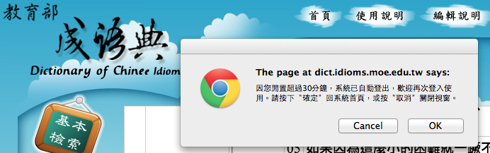
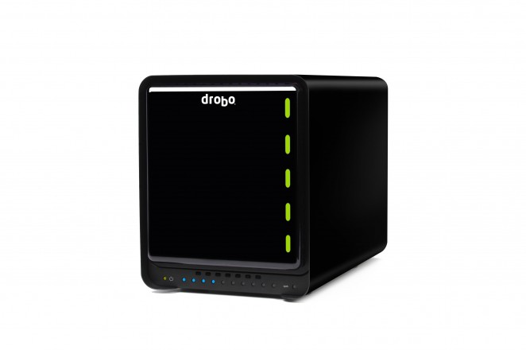

---

layout: default

style: |
    #_ h2 a {
        border-bottom: 1px dotted #eee;
        color: white;
    }
    @font-face {
        font-family: 'Symbola';
        src: url('Symbola602.otf') format('truetype');
    }
    @font-face {
        font-family: 'Ubuntu Mono';
        src: url('UbuntuMono-R.ttf') format('truetype');
    }
    @font-face {
        font-family: 'Ubuntu';
        src: url('Ubuntu-R.ttf') format('truetype');
    }
    #_ h2 {
        margin:65px 0 0;
        color:#FFF;
        text-align:center;
        font-size:70px;
        }
    #_ p {
        margin: 2em 0 0;
        text-align: center;
        color: #FFF;
        font-style: italic;
        font-size: 150%;
        }
        #_ p a {
            color:#FFF;
            }
    .wrap pre {
        white-space: normal !important
    }
    .cover h2 {
        color:#FFF;
        }
    #big5-utf8.shout div h2 {
        font-family: 'Symbola' !important;
    }
    #twblg code {
        display: none;
    }
    span[style="color:#710"] {
        color: #800 !important;
        background: #fff !important;
    }

    span[style="color:#D20"] {
        color: #800 !important;
        background: #ffe !important;
    }
    span[style="color:#F00;background-color:#FAA"] {
        color: #000 !important;
        background: #ffe !important;
    }
    .cover h2 code {
        background: transparent;
        color: white;
        margin-left: -1em;
        font-weight: normal;
        font-family: 'Ubuntu Mono', 'Consolas', 'Menlo', monospace !important;
        }
    body .shout h2 {
        color: #222;
        font-weight: normal;
    }
    body .shout code {
        background: transparent;
        font-weight: normal;
    }
    pre {
        white-space: pre !important;
        font-family: 'Ubuntu Mono', 'Consolas', 'Menlo', monospace !important;
        }
    pre .line-numbers { display: none }
    body .slide:after { display: none }
    .slide img {
        border-radius: 0.5em;
          box-shadow: 0em 0.2em 0.3em 0px #999999;
    }
    .slide img {
        height: 400px;
    }
    .slide blockquote img, .slide.autosize img {
        height: auto;
    }
    .cover img {
        height: 640px;
    }
    .vertical-top p {
        vertical-align: top;
    }

    .slide ul, p {
        font-family: 'Ubuntu', sans-serif;
    }
    .slide ul li, .slide ol li {
        font-size: 140%;
    }
    .slide ul li li, .slide ol li li {
        font-size: 1em;
    }
    .slide ul li strong, .slide ol li strong {
        color: #c00;
    }
    .shout {
        background: #eee;
    }
    iframe {
        width: 800px;
        height: 400px;
    }
    #SeeMore h2 {
        font-size:100px;
        }
    #SeeMore img {
        width:0.72em;
        height:0.72em;
        }
        br {
            line-height: 1.5em;
        }

    body .cover figure {
        color: white;
    }
    body figcaption {
        float: right;
        font-style: normal !important;
        font-size: 140%;
    }
    body .cover figcaption {
        color: #ccc;
        margin-top: -0.4em;
        margin-right: 0em;
    }
    body blockquote {
        font-style: normal !important;
        font-size: 150%;
    }
    body .cover blockquote {
        font-style: normal;
        font-size: 180%;
        margin-left: 3em;

    }
---

# [PgREST](http://pgre.st/)  Node.js in the Database {#_}

Audrey Tang

<!-- by-nc-sa orkomedix, https://secure.flickr.com/photos/orkomedix/6812055939 -->

## 只講程式 不講故事
{:.shout #just-code-no-stories}

## PgREST is...

* …**JSON** document store
* …Running inside **PostgreSQL**
* …Working with existing **relational** data
* …Capable of loading **Node.js** modules
* …Compatible with MongoLab's **REST API**
* …= `LiveScript` + `PLV8` + `plv8x` + `OneJS`

## JSON

~~~ json
{ "title":    "萌",
  "bopomofo": "ㄇㄥˊ",
  "pinyin":   "méng",
  "definitions": [
    { "type": "名", "def": "草木初生的芽。" },
    { "type": "名", "def": "事物發生的開端或徵兆。" },
    { "type": "名", "def": "人民。" } ] }
~~~

## PostgreSQL

~~~ sql
CREATE TABLE moe ( "entry" JSON );
INSERT INTO moe VALUES ($$
{ "title":"萌", "bopomofo": "ㄇㄥˊ", "pinyin": "méng",
  "definitions": [ { "type": "名", "def": "草木初生的芽。" },
                   { "type": "名", "def": "事物發生的開端或徵兆。" },
                   { "type": "名", "def": "人民。" } ] } $$);

INSERT INTO moe VALUES ('這不是 ㄓㄟ ㄙㄣˇ'); -- type error
~~~

## PLV8

~~~ sql
CREATE EXTENSION plv8;
CREATE FUNCTION get_json_key(obj JSON, key TEXT) returns JSON AS $$
   return JSON.stringify( obj[key] );
$$ LANGUAGE plv8;

SELECT get_json_key(entry, 'bopomofo') FROM moe;
-- "ㄇㄥˊ"
~~~

## plv8x: Operators

~~~ sql
SELECT entry |> 'this.bopomofo' FROM moe;
-- "ㄇㄥˊ"
SELECT entry ~> '@bopomofo' FROM moe;
-- "ㄇㄥˊ"
SELECT '@bopomofo' <~ entry FROM moe;
-- "ㄇㄥˊ"
SELECT ~> 'new Date' FROM moe;
-- "2013-04-17T12:31:57.523Z"
~~~

## plv8x: Command Line

~~~ php
npm i -g plv8x
export PLV8XCONN=dbname
plv8x -r script.ls # .js works too
plv8x -E 'plv8.execute("SELECT entry FROM moe").0.entry.definitions'
# [ { type: '名', def: '草木初生的芽。' },
#   { type: '名', def: '事物發生的開端或徵兆。' },
#   { type: '名', def: '人民。' } ]
~~~

## plv8x: Modules

~~~ php
npm i -g uax11
plv8x -i uax11
plv8x -E 'require "uax11" .toFullwidth "méng"'
# ｍｅ́ｎｇ
~~~

~~~ sql
SELECT entry ~> 'require "uax11" .toFullwidth @pinyin' FROM moe;
-- "ｍｅ́ｎｇ"
~~~

## plv8x: Functions

~~~ php
plv8x -f 'text fullwidth(text)=uax11:toFullwidth'
plv8x -f 'text PINYIN(json)=:&0.pinyin.toUpperCase!'
~~~

~~~ sql
SELECT fullwidth('Ingy döt Net');
-- Ｉｎｇｙ　ｄｏ̈ｔ　Ｎｅｔ
SELECT fullwidth( PINYIN(entry) ) FROM moe;
-- ＭＥ́ＮＧ
~~~

## Summary

* …`V8`: JavaScript engine
* …`PLV8`: Stored procedures in JavaScript
* …`plv8x`: Package manager for PLV8
    * …Turns **NPM** modules into **SQL functions**
    * …**JSON** expressions with `~>` and `<~`
* …Code reuse for **browser** + **server** + **database** !

## Cutting out the Middleware

* Serve JSON **API** from SQL
* Shared **models** & **validation** code
* Put **Business Logic** into DB
* Perfect fit for **Medium Data**&trade;

## @clkao++

## `3du.tw`
{:.cover #3du}

<!-- by Kanko, https://secure.flickr.com/photos/kankan/134663487/ -->

## The Revised MoE Dictionary (1994)

## The Good

* 160,000+ entries
* …Official, high quality sources
* …Rich etymology and historical usage
* …Full text search with regular expressions
* …Still frequently updated!

## The Bad

* Results are not bookmarkable
* …Requires N clicks to get to a definition
* …Rare characters become low-res bitmaps
* …Difficult to use on mobile devices
* …"Optimized for IE 5.0 and Netscape 4.7+"!?

## The Sad

<figure markdown="1">
> 本會非常歡迎各位來連結「國語辭典」，但是本會目前只開放以超連結 (hyperlink) 的方式與國語辭典 **首頁** 連結，至於其他方式本會並未對外開放授權。若還有疑問或建議，歡迎來信。 
<figcaption>／教育部國語推行委員會〈有關授權〉</figcaption>
</figure>

## .…and the Very Crazy

> 不需登入的網頁，會自動把你登出！
> 
> 

## Yeh's Ping, 2013.1.26.

<figure markdown="1">
> 所以我要 **響應** 零時政府 g0v.tw 的活動，來做 3du.tw，把字、詞、成語、定義、例句等等正體中文資料，用開放的文字 API 釋放出來，加上索引和搜尋的功能，讓任何想加值的個人或公司都可以使用。 
<figcaption>／葉平〈還文於民〉</figcaption>
</figure>

## 零時黑客 集體砍站事件
{:.shout #g0v-scraping}

## Hackpad for 3du.tw

## g0v hackath1n, 2013.1.27.

* …Scraped 3000 characters into HTML (au)
* …Scraped 2741 idioms into HTML (TonyQ, MnO2)
* …Designed JSON schema from samples (Ping)
* …Designed SQL schema from samples (albb0920)
* …Parsed HTML into JSON & SQLite (kcwu)

## `←`&#x1f01d; `Big-5` `→`&#x1f00e; `UTF-8`
{:.shout #big5-utf8}

## Crowd-sourcing 1000+ glyphs

## Finished in 24 hours!
{:.autosize}

Thanks to: Favonia, Jun-Yuan Yan, Yao Wei, Yaoting Huang, Poka, Caasi Huang, Daniel Liang, Grey Lee, Irvin Chen, Gugod, Schee…

## 粗略的共識 會動的程式
{:.shout #rough-consensus-running-code}

## Applications

* XUL Desktop App (@racklin)
* OS X Dictionary (@yllan)
* Windows 8 App (@wenpei)
* iOS Client (@tomjpsun, @jamessa, @pct)
* iOS App (@zonble)
 
## Integrations

* AngularJS Client+Server (@viirya)
* Rails API server (@albb0920)
* Chrome Extension (@tonytonyjan)
* Sublime Text plugin (@zonble)
* WinRT Component (@eriksk)

## Fair Use

<figure markdown="1">
> 為非營利之教育目的，依著作權法第 50 條，「以中央或地方機關或公法人之名義公開發表之著作，在合理範圍內，得重製、公開播送或公開傳輸。」此處轉換格式、重新編排的編輯著作權(如果有的話)由 @kcwu 以 `CC0` 釋出。
</figure>

## CC0: Public Domain

<figure markdown="1">
> 除前述資料檔之外，本目錄下的所有其他檔案，由作者 唐鳳 在法律 許可的範圍內，拋棄該著作依著作權法所享有之權利，包括所有相關 與鄰接的法律權利，並宣告將該著作貢獻至公眾領域。
</figure>

## `moedict.tw`
{:.cover #moedict}

## 5 Stars of Open Data

1. ⊙ **Open** License
2. …↔ **Structured** Data
3. …▵ **Non-Proprietary** Format
4. …✧ Each Item has an **URI**
5. …✩ **Linking** between Items

## URI Endpoints

* `https://moedict.tw/#文字`
* …3 APIs (for __non-Unicode__ characters):
    * `/raw/文字.json` ⇒ `{[8ff0]}` 
    * `/uni/文字.json` ⇒ `⿰亻壯`
    * `/pua/文字.json` ⇒ `U+F8FF0`

## Private-Use Web Fonts

* Initially based on Hán Nôm font (Yao Wei)
    * Subset everything outside Big5 range
    * Hand-drawn PUA chars like ⿰亻壯
* …Later on, switched to Hanazono 花園明朝 font
    * 75,619 + 8,236 glyphs
    * From 花園大学国際禅学研究所

## 科技始終 來自於佛性
{:.shout #technology-buddha-nature}

## Live Demo

<iframe data-src="https://moedict.tw/#文字"></iframe>
<!-- Replace with localhost with autofocus OFF -->

## Getting to the Fifth Star

1. ⊙ Open License
2. ↔ Structured Data
3. ▵ Non-Proprietary Format
4. ✧ Each Item has an URI
5. ✩ **Linking between Items**

## Chinese Segmentation

* No whitespaces between words
* Lots of heuristic algorithms
* Naive solution: Longest-token match
    * Requires a large dictionary
    * ...wait, we just got one here

## Initial Implementation

* XXX For the client side
* XXX: lenToRegex

## Works well, but...

* Freezes IE8, crashes IE7
    * Broken on Android 2.x, too
* So let's pre-segment everything
    * Needs a tool to move JS into DB
    * ...wait, we just got one here

## `/a/pua/文字.json`
{:.wrap}

~~~ json
{"h":[{"b":"ㄨㄣˊ ㄗˋ","d":[{"f":"`人類~`用來~`表示~`觀念~、`記錄~`語言~`的~`符號~。","s":"`筆墨~,`翰墨~"},{"f":"`文書~。","q":["`五代史~`平話~．`梁~`史~．`卷~`上~：「`您~`去~`攻破~`宋~`州~，`為我~`奪取~`張~`節使~`歸~`娘~。`才~`得~，`便~`發文~`字~`來~`報~`我~。」","`警世通言~．`卷~`十~`三~．`三~`現身~`包龍圖~`斷~`冤~：「`有~`甚事~`煩惱~？`想~`是~`縣~`裡~`有~`甚~`文字~`不了~。」"]}],"p":"wén zì"}],"t":"`文~`字~"}
~~~

## Live Demo, part II

<iframe data-src="https://moedict.tw/#文字"></iframe>
<!-- Replace with localhost with autofocus OFF -->

## Materialized View: 160k .json files
{:.vertical-top}

(@obra++)

## Let's PhoneGap it!

* …Freezes XCode
* …Crashes Eclipse
* …Solution: Pack into 1024 .txt files
    * Using the last 10 bits of the first word
    * Load related words in the same bucket

## Google Play & App Store

## Star-Driven Development

* Wildcard and part-of-word searching
* …Two-column layout for tablets (@hlb++)
* …Toggle position of Pinyin vs Bopomofo
* …Volume key on Android to resize fonts!
* …Top Request: **Taiwanese Bân-lâm-gi**

## `twblg.moedict.tw`
{:.cover #twblg}

## Personal Motivation

* Grandparents were my main caretakers
    * …Grandma from Lo̍k-káng, Taiwan
    * …Grandpa from Sì-chuān, China
* …Raised biligually as a pre-schooler
    * …But only Mandarin had a writing system
    * …Editing her memoir brought back memories

## Taiwan Bân-lâm-gi Common Dictionary
{:.vertical-top}

(2011)

## Good Parts

* Unified Romanization system (TL)
* Standardized Ideographic characters (RHC)
* Full text search in Mandarin, TL or RHC
* MP3 pronounciations of all entries
* Licensed under CC-BY-ND 3.0

## Not-so-good Parts

* Entries are in non-bookmarkable iframes
* Still uses bitmaps for Ext-B+ fonts
* No corresponding Mandarin from entries
* Easy to scrap but hard to parse

## g0v hackath2n, 2013.3.23.

## Crowd-sourcing 154 glyphs

<iframe data-src="https://ethercalc.org3du-holohak"></iframe>

## Finished over lunch!

<iframe data-src="http://www.plurk.com/p/icne8t"></iframe>
<!-- TODO XXX: Thank everybody -->

## Database received, 2013.3.27.

* `詞目總檔.xls` `詞目總檔.屬性對照.xls`
* `釋義.xls` `釋義.詞性對照.xls`
* `又音.xls` `又音.屬性對照.xls`
* `近義詞對應.xls` `反義詞對應.xls`
* `詞彙方言差.xls` `語音方言差.xls`
* `例句.xls`

## What about that extra request?

> 您好： 
> 資料匯入目前大致無誤。不過，twblg 網頁上的「華語檢索」，可以用「一乾二淨」找到閩語典的「離離」條目，這個對照表似乎沒有在 Excel 檔中看到？

## Well...

> 語言之間的對譯，不能盡然以詞彙對應，對不夠深入了解的使用者來說，會讓他誤以為A語言的X詞等於B語言的Y詞（並且這種呈現，會被民眾認知為「教育部的辭典說的」），這有很大的語言教育問題，所以那個跨語平台後來收掉了。

## However...

> 因此，華語對應這個欄位，我們是藏在系統中，目的是讓不會閩南語拼音用字的人也能查到他要的詞彙，但又基於上述理由不能把這些詞彙呈現給使用者。如果是民間的辭典編輯，會比較沒有這個負擔，因此我這裡確實不能給，非常希望你們能有辦法解決。

## ...it's all good.

> 好的，感謝您的提醒和協助。 
> 目前從網頁以 Big5 範圍取出的華語條目，共有 26274 筆對映。 
> 在應用上，這部份我們會註明不屬於教育部 CC-BY-ND 的授權範圍。

## Data Cleanup, 2013.3.30.

* 3 stars: ▵ Non-Proprietary Format
* Converted all .xsl to .csv with LibreOffice 4
* Replaced PUA characters with mapped Unicode
* Added `x-造字.csv` and `x-華語對照表.csv	`
* Time to put PgREST to work!

## PgREST: Import/Export

~~~ php
pgrest dbname
export API=http://127.0.0.1:3000
curl -i -X PUT -H "Content-Type: text/csv" \
     --data-binary @uni/詞目總檔.csv $API/collections/entries

curl $API/collections/entries
{"主編號","1","屬性":"1","詞目":"一","音讀":"tsi̍t",
 "文白俗替":"替","部首":"一","部首序":"001-00-01","方言差":""}
~~~

## PgREST: MongoLab REST API

* XXX API Map

## PgREST: 3du.tw JSON in 48 lines 

<https://github.com/g0v/moedict-data-twblg/blob/master/gen.ls>

> 

## Live Demo, part III

## Lessons Learned

* XXX more reflections
* Create conversations with all participants
* Keep a kind heart; assume the best intentions

## 宅心仁厚 仁者無敵
{:.shout #nerds-without-enemies}

## When is Transparency Useful?

<figure markdown="1">
> 眾人為了共同目標聚在一起，才能做出改變，科技人很難獨力完成。 
> 衡量成功的標準，可以是有多少人的生命因你獲得改善，而不只是有多少人看你架的網站。
<figcaption>— Aaron Swartz, «Open Government»</figcaption>
</figure>

## 開站一時 開源一輩子
{:.shout #site-a-time-source-a-lifetime}

## Thank you!
{:.cover}

## Thank you!
{:.cover #answer}

<figure markdown="1">
> 新的轉機和閃閃星斗， 
> 正在綴滿沒有遮攔的天空。 
> 那是五千年的象形文字， 
> 那是未來人們凝視的眼睛。
<figcaption>／北島〈回答〉</figcaption>
</figure>

<!-- by-nc-sa orkomedix, https://secure.flickr.com/photos/orkomedix/6812055939 -->
