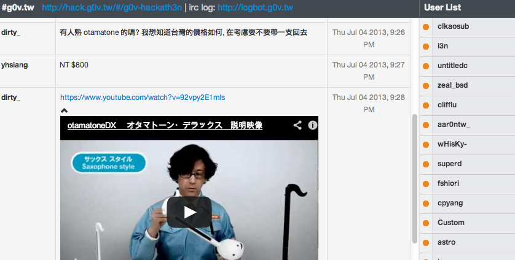

---

layout: default

style: |
    #_ h2 a {
        border-bottom: 1px dotted #eee;
        color: white;
        line-height: 200%;
        font-size: 60px;
        font-weight: normal;
        font-family: 'EBAS';
    }
    #thank-you > div, #answer > div {
        padding-top: 64px !important;
    }
    #why img {
        width: 100px;
        height: 100px;
    }
    #subway img {
        width: 150px;
        height: 150px;
        float: left;
        margin-right: 10px;
    }
    #blackout h2 {
        margin-top: -70px;
        margin-left: -30px;
    }
    #decentralization h2 {
        color: black !important;
        margin-top: -80px;
        margin-left: 245px;
        display: none;
    }
    body .slide:not(.shout):not(.cover) > div {
        padding-top: 72px;
    }
    @font-face {
        font-family: 'Symbola';
        src: url('Symbola602.otf') format('truetype');
    }
    @font-face {
        font-family: 'Ubuntu Mono';
        src: url('UbuntuMono-R.ttf') format('truetype');
    }
    @font-face {
        font-family: 'Ubuntu';
        src: url('Ubuntu-R.ttf') format('truetype');
    }
    @font-face {
        font-family: 'EBAS';
        src: url('EBAS-Subset.ttf') format('truetype');
    }
    #_ h2 {
        margin: 0;
        color:#FFF;
        text-align:center;
        font-size:70px;
        }
    #_ p {
        text-align: center;
        color: #FFF;
        font-size: 150%;
        font-family: 'Ubuntu Mono', monospace;
        }
        #_ p a {
            text-decoration: none;
            border: none;
            color:#FFF;
            }
    .wrap pre {
        white-space: normal !important
    }
    .cover h2 {
        color:#FFF;
        }
    #big5-utf8.shout div h2 {
        font-family: 'Symbola' !important;
    }
    #twblg code {
        display: none;
    }
    span[style="color:#710"] {
        color: #800 !important;
        background: #fff !important;
    }

    span[style="color:#D20"] {
        color: #800 !important;
        background: #ffe !important;
    }
    span[style="color:#F00;background-color:#FAA"] {
        color: #000 !important;
        background: #ffe !important;
    }
    h2 code {
        background: transparent !important;
        font-weight: normal;
        font-family: 'Ubuntu Mono', 'Consolas', 'Menlo', monospace !important;
        color: #666 !important;
    }

    .cover h2 code {
        color: white !important;
        margin-left: -1em;
        }
    body .shout h2 {
        color: #222;
        font-weight: normal;
    }
    body .shout code {
        background: transparent;
        font-weight: normal;
    }
    body .shout br {
        line-height: 175%;
    }
    pre {
        white-space: pre !important;
        font-family: 'Ubuntu Mono', 'Consolas', 'Menlo', monospace !important;
        }
    pre .line-numbers { display: none }
    body .slide:after { display: none }
    .slide img {
        border-radius: 0.5em;
          box-shadow: 0em 0.2em 0.3em 0px #999999;
    }
    .slide blockquote img, .slide.autosize img {
        height: auto;
    }
    .cover img {
        height: 640px;
    }
    .vertical-top p {
        vertical-align: top;
    }

    .slide ul, p {
        font-family: 'Ubuntu', sans-serif;
    }
    .slide ul li, .slide ol li {
        font-size: 140%;
    }
    .slide ul li li, .slide ol li li {
        font-size: 1em;
    }
    .slide b:before {
        content: '·';
        color: #ccc;
        padding-right: 10px;
        font-size: 30px;
        line-height: 20px;
    }
    .slide ul li strong, .slide ol li strong, b {
        color: #c00;
    }
    .shout {
        background: #eee;
    }
    iframe {
        width: 800px;
        height: 400px;
    }

    body .cover figure {
        color: white;
    }
    body figcaption {
        float: right;
        font-style: normal !important;
        font-size: 140%;
    }
    body .cover figcaption {
        color: #ccc;
        margin-top: -0.4em;
        margin-right: 0em;
    }
    body .smaller blockquote {
        font-style: normal !important;
        font-size: 135%;
    }
    body blockquote {
        font-style: normal !important;
        font-size: 150%;
    }
    body .cover blockquote {
        font-style: normal;
        font-size: 180%;
        margin-left: 3em;

    }
---

# [Using Angular.js in Existing Projects](#) {#_}

And a glimpse of the components

angularjs.tw#3 [@clkao](http://github.com/clkao)

## @clkao

### 最近都在...

## Why?

...Animation is cool!  as we learned [last time](slid.es/gsklee/animation-in-angularjs)

... ++

...lots of angularjs modules are now available, and you don't need to be in a pure ng-world to use them.

{:#why}

## A little recap

No controller, if the interaction is trivial: (Using ui-bootstrap)

~~~ php
.btn-group
  a.btn(ng-model="type",btn-radio="'price'") Price
  a.btn(ng-model="type",btn-radio="'unitprice'") Unit

.leaflet(class="aggregate-{​{ type }}",resize)
~~~

Implicit `$scope`.

## In html

~~~ html

  <a ng-model="type" btn-radio="'price'" class="btn">Price</a>
  <a ng-model="type" btn-radio="'unitprice'" class="btn">Unit</a>

~~~

...You can now use .aggregate-price and .aggregate-unit selectors to control the display inside leaflet

## sass

~~~ css
.aggregate-marker span
  display: none

.leaflet
  &.aggregate-price
    .aggregate-marker span.price
      display: block
  &.aggregate-unitprice
    .aggregate-marker span.unitprice
      display: block
~~~

## Demo

[realprice.g0v.tw](http://realprice.g0v.tw)

## bootstrap

Basically what `<html ng-app>` does for us.

Similar to:

~~~ javascript
angular.bootstrap($element)
~~~

## bootstrapping in existing project
{:#subway}

Let's walk through this by modifying a real project.

...Subway - an IRC web UI built with Backbone   

...`WARNING` just an example, not for practical reason nor complete.

...github.com/clkao/subway angulardemo branch

## Let's change the user list

## fragments

Subway does some client side templating in ChatView:

~~~ javascript
this.setelement(ich.templates.chat);
angular.bootstrap(this.$el, []);
~~~

So let's just bootstrap after the template is rendered

...But if you do something more complicated, you need $compile

## $compile

Every time you do `$element.html('
...
')` a kitten dies.  Save them with:

~~~ javascript
$injector = angular.element(root).data('$injector');
$scope = angular.element($element).scope();

$compile = $injector.invoke(function($compile) { return $compile });
$compile(element)($scope);
~~~

## $digest

when data (dom values or refrences) changed in non-angular context, manually $digest the $scope.

~~~  javascript
$scope = angular.element(this._element).scope();
$scope.users.push(User.attributes);
$scope.$digest();
~~~

## Controller

* = modular $scope helper
* enabe with ng-controller tag attributes
* or ui-router state rule

## Module

Essentially a collection of *things*, can load other dependencies.

~~~ javascript
angular.module('subway', ['ui-bootstrap'])
.controller('UserList', function($scope) {
  $scope.users = []
});

angular.bootstrap($element, ['subway'])
~~~

## $scope scope

Many directives create new scopes.  Some creates isolated scopes.

~~~ php
.userlist_user(ng-repeat="user in users") ## new scope with iterator
  div(class="userlist_user_activity")
    img(ng-src="/assets/images/{{user.user_status}}.png")
~~~
..."prototopical copy" - If you don't know what it means, use an object if you want the child scopes to be able to *update* scope variables.

...or use $parent, but can be tricky when there are many levels of scopes.

[Understanding Scopes](https://github.com/angular/angular.js/wiki/Understanding-Scopes)

## Break

## Service

* communication between Controllers.
* ...persistent across controller

## Service - auth example

~~~ php
.controller Foo: ($scope, myAuthService) ->
  $scope.$on 'event:auth-loggedin' -> # dosomething

.factory Hub: ($http, $rootScope) ->
    login: ->
      # if logged-in:
      $rootScope.$broadcast 'event:auth-loggedin', {user}
~~~

## Directives

Remember `resize`?

~~~ php
.leaflet(resize)
  leaflet(ng-style='{width:  $parent.width,
                     height: $parent.contentHeight}')
~~~

## Resize

~~~ php
.directive 'resize' ($window) ->
  ($scope, element, attrs) ->
    refresh-size = ->
      $scope.width = $window.innerWidth
      $scope.content-height = $scope.height = $window.innerHeight
      $scope.content-height -= $(element).offset().top
    angular.element($window).bind 'resize' ->
      $scope.$apply refresh-size
    refresh-size!
~~~

## Directives

All dom interaction should be defined as directives.

[The Hitchhiker’s Guide to the Directive](http://amitgharat.wordpress.com/2013/06/08/the-hitchhikers-guide-to-the-directive/)

## Route v.s. State

Builtin router = route -> view -> controller

...Use ui-router instead: route -> state <- controller

## Thank you!
{:.cover}

